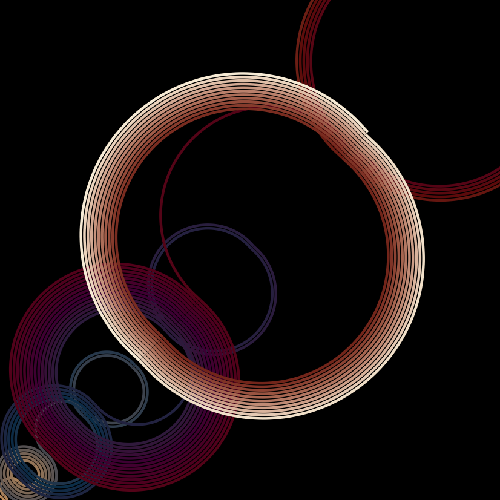
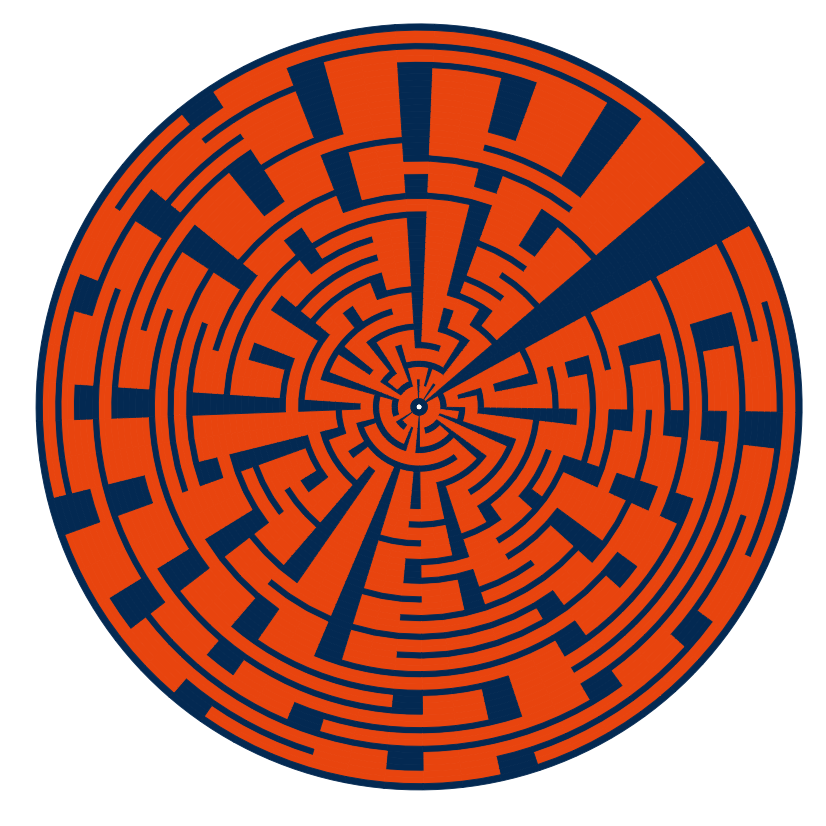
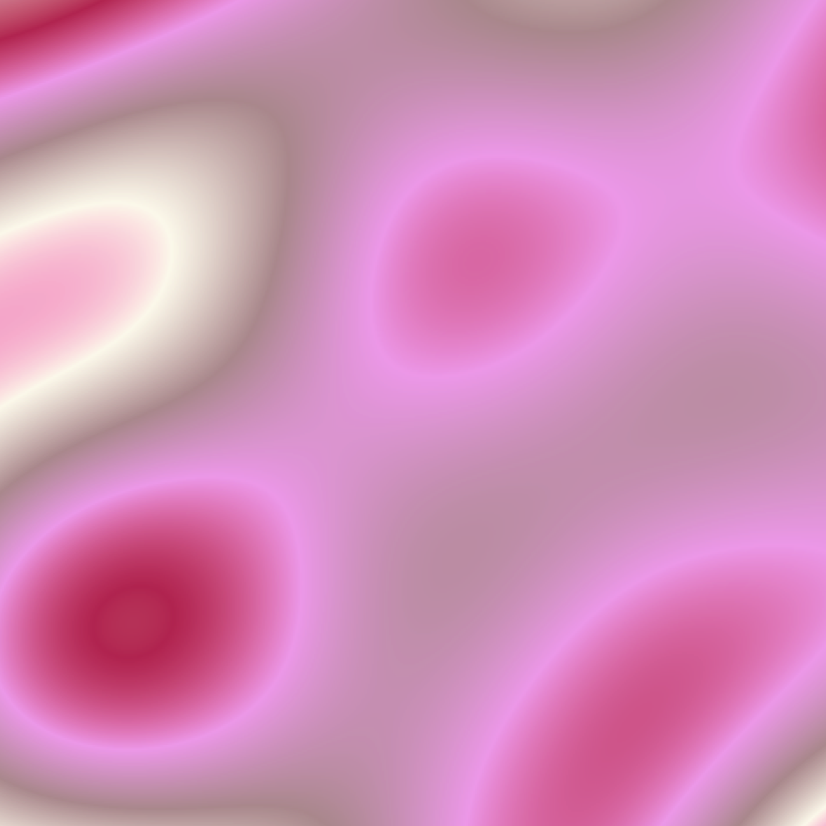

```{r setup, include=FALSE}
knitr::opts_chunk$set(echo = TRUE)
```


```{r, echo=FALSE}
library(aRtsy)
```

**Art Piece #1**

*Another Solar System* 

```{r, echo=FALSE, eval=FALSE}
set.seed(40)
artwork.1 = canvas_recaman(colors = colorPalette("tuscany2"), size=0.5, background="black",
                           curvature=1.1, angle=45)
saveCanvas(artwork.1, filename = "Artwork1.png")
```




**Art Piece #2**

*Bucky's Maze*

```{r, echo=FALSE, eval=FALSE}
set.seed(2)
artwork.2= canvas_maze(color = c("#EF5B0C"), walls= c("#003865"), background = "white", polar=TRUE)
saveCanvas(artwork.2, filename = "Artwork2.png")
```



**Art Piece #3**

*Barbie's Lucid Dream* 

```{r, echo=FALSE, eval=FALSE}
set.seed(3)
artwork.3= canvas_blacklight(colors = colorPalette("blossom"), n=1000)
saveCanvas(artwork.3, filename = "Artwork3.png")
```

